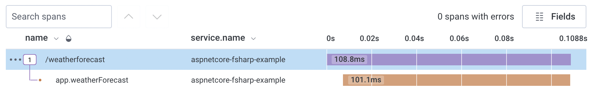

# Honeycomb.OpenTelemetry ASP.NET Core web example

This example shows how to use the Honeycomb OpenTelemetry distro with a .NET Core web application.

## Using the Example

- First, set your Honeycomb API key and a service name in the [appsettings.json](appsettings.json) configuration file.
- If you are using Honeycomb Classic, add `TracesDataset`.
- If you are sending Metrics, add `MetricsDataset`.

Run `dotnet run` to start the app.

To generate telemetry, navigate to `localhost:5001/weatherforecast`.

As part of the configuration process, an instance of the Tracer is registed in the services Dependency Injection map that can be be injected into controllers and used to add additional context and create additional spans.

See [Program.fs](https://github.com/honeycombio/honeycomb-opentelemetry-dotnet/blob/main/examples/aspnetcore-fsharp/Program.fs#L22) for an example of how the `AddHoneycomb` method is called.

See [Routing.fs](https://github.com/honeycombio/honeycomb-opentelemetry-dotnet/blob/main/examples/aspnetcore-fsharp/Routing.fs#L38) for an example app being instrumented.
